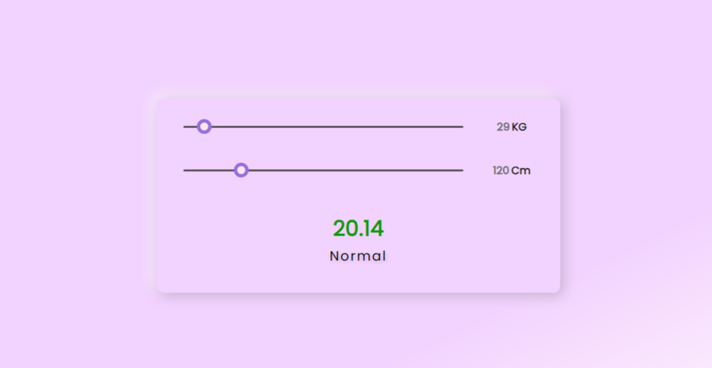

<h1 align="center">In the Name Of God</h1>

- **🌱 Beautiful BMI calculator**

-  **🆓 Free to the public**
 
- - - - - - - - - - - - - - - - - - -  
🛠️  Attributes : 
 
<ul>
  <li>Clean coding and easy to understand for the audience</li>
  <li>beautiful design</li>
  <li>Customization capability</li>
  <li>Responsive</li>
  <li>Light code and fast execution</li>
</ul>
 
⚒  Language & Tool :
<ul>
  <li>Html</li>
  <li>Css</li>
  <li>Javascript</li>
</ul>
▪ ▪ ▪ ▪ ▪ ▪ ▪ ▪ ▪ ▪ ▪ ▪ ▪ ▪ ▪ ▪ ▪ ▪ ▪ ▪ ▪ ▪ ▪ ▪ ▪ ▪  ▪ ▪ ▪ ▪ ▪ ▪ ▪ ▪ ▪ ▪ ▪ ▪ ▪ ▪ ▪ ▪ ▪ ▪ ▪ ▪ ▪ ▪ ▪ ▪ ▪ ▪ ▪ ▪ ▪ ▪ ▪ ▪ ▪ 
🖼️ Picture :
 
 

 
- - - - - - - - - - - - - - - - - - - 
<h3 align="left">Connect with me:</h3>

    

 
- - - - - - - - - - - - -  - - - - - - 
 
 
Thank you for your beautiful look :) 🤍
   
-🙍‍♂️<i>Hojjat Hekmatipour</i>